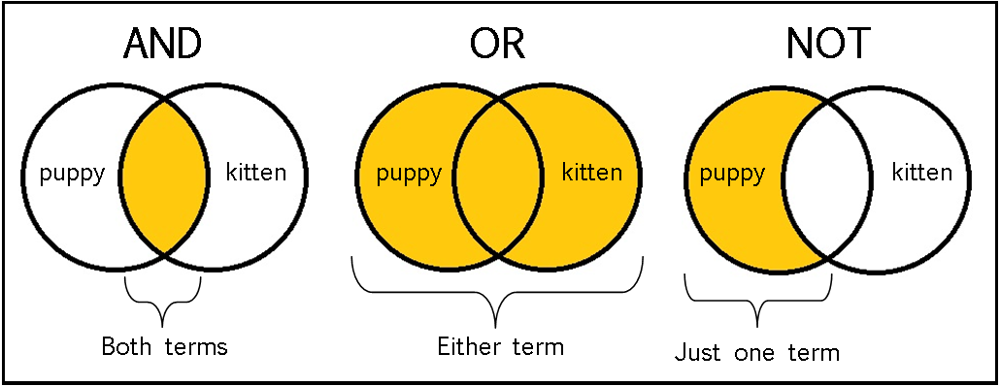

# python section 2
## [Part 2 Notebook](https://github.com/bigmpc/python-with-m/blob/main/Part_2/notebook.ipynb)

----
- conditionds
    - boolean conditionds
    - numberic conditions
    - ‍‍`is` vs `==`
        - `id()` function
- some python keywords and usage
- input function
    - casting

- advance datatype
    
    - list
        - indexing
        - functions
    - string 
        - indexing
        - function
    - dict
        - functions
    - `in` keyword
    - dict vs list
    - del 

---
## conditionds:
### if conditiond true return `True` else Return `False`
**boolean type in python**


```python
True , False
```


    (True, False)


```python
type(True)
```


    bool


### boolean conditionds
`==` , `!=` , `and` , `or` , `not`


# `==` check for equality 


```python
2 == 2
```


    True


```python
2 == 2.1
```


    False


```python
True == False
```


    False


```python
# `!=` check for inequality 
```


```python
2 != "ali"
```


    True


```python
"amin" != "amin"
```


    False


## Boolean logic



**`and`**


```python
True and True
```


    True


```python
True and False
```


    False


```python
False and False
```


    False


**`or`**


```python
True or False # also False or True
```


    True


```python
True or True
```


    True


```python
False or False
```


    False


**`not`**


```python
not True
```


    False


```python
not False
```


    True


```python
not(2 + 2 == 4)
```


    False


## numberic conditions
`>`, `<`, `> =`, `< =`

**example: check `a > b > c` where a is 10 , b is 5 and a is -100**


```python
a = 10
b = 5
c = -100
print(a > b , b > c)
```

    True True


```python
a > b and b > c
```


    True


```python
3 > 2 or 2 > 100
```


    True


```python
1 >= 2  ,  2  <= 3 
```


    (False, True)


### is vs ==


```python
lst_1 = []
lst_2 = []

lst_1 == lst_2
```


    True


```python
lst_1 is lst_2
```


    False


```python
id(lst_1), id(lst_2)
```


    (140366785382472, 140366785382280)


**`==` for checking value is same**

**`is` for cheking memory value is same**

learn more:
**[Difference between == and is operator in Python](https://www.geeksforgeeks.org/difference-operator-python/)**

**Pro tip: don't use `is`**

## some python keywords
---


`and` Boolean logic

`or` Boolean logic

`not` Boolean logic

`is` check memory id is same

`in` check some thing in `some_variable`

`pass` for pass indent

`del` del variable


# input function
```python
input(string_for_print*)
```
* it's not required


```python
name = input("Enter Your name: ")
print(name)
```

    Enter Your name: amin sharifi
    amin sharifi


```python
help(input)
```

    Help on method raw_input in module ipykernel.kernelbase:
    
    raw_input(prompt='') method of ipykernel.ipkernel.IPythonKernel instance
        Forward raw_input to frontends
        
        Raises
        ------
        StdinNotImplentedError if active frontend doesn't support stdin.
    


**check name type**


```python
type(name)
```


    str


**how to get number?**


```python
number = input("Enter A Number: ")
number
```

    Enter A Number: 12


    '12'


```python
number // 2 # ?
```


    ---------------------------------------------------------------------------

    TypeError                                 Traceback (most recent call last)

    <ipython-input-29-755a57b19fb9> in <module>
    ----> 1 number // 2 # ?
    

    TypeError: unsupported operand type(s) for //: 'str' and 'int'


## casting: Convert one datatype to other datatypes
### like:

**str -> int**

**float -> str**

**int -> str**


```python
number = int(input("Enter A Number: "))
number
```

    Enter A Number: 12


    12


```python
type(number)
```


    int


```python
number // 2
```


    6


### other casting
---


```python
# convert int and float to string
str(10) , str(3.14)
```


    ('10', '3.14')


```python
# convert string to float and int
int("3") , float("12.60")
```


    (3, 12.6)


```python
help(int) , help(float)
```

    Help on class int in module builtins:
    
    class int(object)
     |  int(x=0) -> integer
     |  int(x, base=10) -> integer
     |  
     |  Convert a number or string to an integer, or return 0 if no arguments
     |  are given.  If x is a number, return x.__int__().  For floating point
     |  numbers, this truncates towards zero.
     |  
     |  If x is not a number or if base is given, then x must be a string,
     |  bytes, or bytearray instance representing an integer literal in the
     |  given base.  The literal can be preceded by '+' or '-' and be surrounded
     |  by whitespace.  The base defaults to 10.  Valid bases are 0 and 2-36.
     |  Base 0 means to interpret the base from the string as an integer literal.
     |  >>> int('0b100', base=0)
     |  4
     |  
     |  Methods defined here:
     |  
     |  __abs__(self, /)
     |      abs(self)
     |  
     |  __add__(self, value, /)
     |      Return self+value.
     |  
     |  __and__(self, value, /)
     |      Return self&value.
     |  
     |  __bool__(self, /)
     |      self != 0
     |  
     |  __ceil__(...)
     |      Ceiling of an Integral returns itself.
     |  
     |  __divmod__(self, value, /)
     |      Return divmod(self, value).
     |  
     |  __eq__(self, value, /)
     |      Return self==value.
     |  
     |  __float__(self, /)
     |      float(self)
     |  
     |  __floor__(...)
     |      Flooring an Integral returns itself.
     |  
     |  __floordiv__(self, value, /)
     |      Return self//value.
     |  
     |  __format__(...)
     |      default object formatter
     |  
     |  __ge__(self, value, /)
     |      Return self>=value.
     |  
     |  __getattribute__(self, name, /)
     |      Return getattr(self, name).
     |  
     |  __getnewargs__(...)
     |  
     |  __gt__(self, value, /)
     |      Return self>value.
     |  
     |  __hash__(self, /)
     |      Return hash(self).
     |  
     |  __index__(self, /)
     |      Return self converted to an integer, if self is suitable for use as an index into a list.
     |  
     |  __int__(self, /)
     |      int(self)
     |  
     |  __invert__(self, /)
     |      ~self
     |  
     |  __le__(self, value, /)
     |      Return self<=value.
     |  
     |  __lshift__(self, value, /)
     |      Return self<<value.
     |  
     |  __lt__(self, value, /)
     |      Return self<value.
     |  
     |  __mod__(self, value, /)
     |      Return self%value.
     |  
     |  __mul__(self, value, /)
     |      Return self*value.
     |  
     |  __ne__(self, value, /)
     |      Return self!=value.
     |  
     |  __neg__(self, /)
     |      -self
     |  
     |  __new__(*args, **kwargs) from builtins.type
     |      Create and return a new object.  See help(type) for accurate signature.
     |  
     |  __or__(self, value, /)
     |      Return self|value.
     |  
     |  __pos__(self, /)
     |      +self
     |  
     |  __pow__(self, value, mod=None, /)
     |      Return pow(self, value, mod).
     |  
     |  __radd__(self, value, /)
     |      Return value+self.
     |  
     |  __rand__(self, value, /)
     |      Return value&self.
     |  
     |  __rdivmod__(self, value, /)
     |      Return divmod(value, self).
     |  
     |  __repr__(self, /)
     |      Return repr(self).
     |  
     |  __rfloordiv__(self, value, /)
     |      Return value//self.
     |  
     |  __rlshift__(self, value, /)
     |      Return value<<self.
     |  
     |  __rmod__(self, value, /)
     |      Return value%self.
     |  
     |  __rmul__(self, value, /)
     |      Return value*self.
     |  
     |  __ror__(self, value, /)
     |      Return value|self.
     |  
     |  __round__(...)
     |      Rounding an Integral returns itself.
     |      Rounding with an ndigits argument also returns an integer.
     |  
     |  __rpow__(self, value, mod=None, /)
     |      Return pow(value, self, mod).
     |  
     |  __rrshift__(self, value, /)
     |      Return value>>self.
     |  
     |  __rshift__(self, value, /)
     |      Return self>>value.
     |  
     |  __rsub__(self, value, /)
     |      Return value-self.
     |  
     |  __rtruediv__(self, value, /)
     |      Return value/self.
     |  
     |  __rxor__(self, value, /)
     |      Return value^self.
     |  
     |  __sizeof__(...)
     |      Returns size in memory, in bytes
     |  
     |  __str__(self, /)
     |      Return str(self).
     |  
     |  __sub__(self, value, /)
     |      Return self-value.
     |  
     |  __truediv__(self, value, /)
     |      Return self/value.
     |  
     |  __trunc__(...)
     |      Truncating an Integral returns itself.
     |  
     |  __xor__(self, value, /)
     |      Return self^value.
     |  
     |  bit_length(...)
     |      int.bit_length() -> int
     |      
     |      Number of bits necessary to represent self in binary.
     |      >>> bin(37)
     |      '0b100101'
     |      >>> (37).bit_length()
     |      6
     |  
     |  conjugate(...)
     |      Returns self, the complex conjugate of any int.
     |  
     |  from_bytes(...) from builtins.type
     |      int.from_bytes(bytes, byteorder, *, signed=False) -> int
     |      
     |      Return the integer represented by the given array of bytes.
     |      
     |      The bytes argument must be a bytes-like object (e.g. bytes or bytearray).
     |      
     |      The byteorder argument determines the byte order used to represent the
     |      integer.  If byteorder is 'big', the most significant byte is at the
     |      beginning of the byte array.  If byteorder is 'little', the most
     |      significant byte is at the end of the byte array.  To request the native
     |      byte order of the host system, use `sys.byteorder' as the byte order value.
     |      
     |      The signed keyword-only argument indicates whether two's complement is
     |      used to represent the integer.
     |  
     |  to_bytes(...)
     |      int.to_bytes(length, byteorder, *, signed=False) -> bytes
     |      
     |      Return an array of bytes representing an integer.
     |      
     |      The integer is represented using length bytes.  An OverflowError is
     |      raised if the integer is not representable with the given number of
     |      bytes.
     |      
     |      The byteorder argument determines the byte order used to represent the
     |      integer.  If byteorder is 'big', the most significant byte is at the
     |      beginning of the byte array.  If byteorder is 'little', the most
     |      significant byte is at the end of the byte array.  To request the native
     |      byte order of the host system, use `sys.byteorder' as the byte order value.
     |      
     |      The signed keyword-only argument determines whether two's complement is
     |      used to represent the integer.  If signed is False and a negative integer
     |      is given, an OverflowError is raised.
     |  
     |  ----------------------------------------------------------------------
     |  Data descriptors defined here:
     |  
     |  denominator
     |      the denominator of a rational number in lowest terms
     |  
     |  imag
     |      the imaginary part of a complex number
     |  
     |  numerator
     |      the numerator of a rational number in lowest terms
     |  
     |  real
     |      the real part of a complex number
    
    Help on class float in module builtins:
    
    class float(object)
     |  float(x) -> floating point number
     |  
     |  Convert a string or number to a floating point number, if possible.
     |  
     |  Methods defined here:
     |  
     |  __abs__(self, /)
     |      abs(self)
     |  
     |  __add__(self, value, /)
     |      Return self+value.
     |  
     |  __bool__(self, /)
     |      self != 0
     |  
     |  __divmod__(self, value, /)
     |      Return divmod(self, value).
     |  
     |  __eq__(self, value, /)
     |      Return self==value.
     |  
     |  __float__(self, /)
     |      float(self)
     |  
     |  __floordiv__(self, value, /)
     |      Return self//value.
     |  
     |  __format__(...)
     |      float.__format__(format_spec) -> string
     |      
     |      Formats the float according to format_spec.
     |  
     |  __ge__(self, value, /)
     |      Return self>=value.
     |  
     |  __getattribute__(self, name, /)
     |      Return getattr(self, name).
     |  
     |  __getformat__(...) from builtins.type
     |      float.__getformat__(typestr) -> string
     |      
     |      You probably don't want to use this function.  It exists mainly to be
     |      used in Python's test suite.
     |      
     |      typestr must be 'double' or 'float'.  This function returns whichever of
     |      'unknown', 'IEEE, big-endian' or 'IEEE, little-endian' best describes the
     |      format of floating point numbers used by the C type named by typestr.
     |  
     |  __getnewargs__(...)
     |  
     |  __gt__(self, value, /)
     |      Return self>value.
     |  
     |  __hash__(self, /)
     |      Return hash(self).
     |  
     |  __int__(self, /)
     |      int(self)
     |  
     |  __le__(self, value, /)
     |      Return self<=value.
     |  
     |  __lt__(self, value, /)
     |      Return self<value.
     |  
     |  __mod__(self, value, /)
     |      Return self%value.
     |  
     |  __mul__(self, value, /)
     |      Return self*value.
     |  
     |  __ne__(self, value, /)
     |      Return self!=value.
     |  
     |  __neg__(self, /)
     |      -self
     |  
     |  __new__(*args, **kwargs) from builtins.type
     |      Create and return a new object.  See help(type) for accurate signature.
     |  
     |  __pos__(self, /)
     |      +self
     |  
     |  __pow__(self, value, mod=None, /)
     |      Return pow(self, value, mod).
     |  
     |  __radd__(self, value, /)
     |      Return value+self.
     |  
     |  __rdivmod__(self, value, /)
     |      Return divmod(value, self).
     |  
     |  __repr__(self, /)
     |      Return repr(self).
     |  
     |  __rfloordiv__(self, value, /)
     |      Return value//self.
     |  
     |  __rmod__(self, value, /)
     |      Return value%self.
     |  
     |  __rmul__(self, value, /)
     |      Return value*self.
     |  
     |  __round__(...)
     |      Return the Integral closest to x, rounding half toward even.
     |      When an argument is passed, work like built-in round(x, ndigits).
     |  
     |  __rpow__(self, value, mod=None, /)
     |      Return pow(value, self, mod).
     |  
     |  __rsub__(self, value, /)
     |      Return value-self.
     |  
     |  __rtruediv__(self, value, /)
     |      Return value/self.
     |  
     |  __setformat__(...) from builtins.type
     |      float.__setformat__(typestr, fmt) -> None
     |      
     |      You probably don't want to use this function.  It exists mainly to be
     |      used in Python's test suite.
     |      
     |      typestr must be 'double' or 'float'.  fmt must be one of 'unknown',
     |      'IEEE, big-endian' or 'IEEE, little-endian', and in addition can only be
     |      one of the latter two if it appears to match the underlying C reality.
     |      
     |      Override the automatic determination of C-level floating point type.
     |      This affects how floats are converted to and from binary strings.
     |  
     |  __str__(self, /)
     |      Return str(self).
     |  
     |  __sub__(self, value, /)
     |      Return self-value.
     |  
     |  __truediv__(self, value, /)
     |      Return self/value.
     |  
     |  __trunc__(...)
     |      Return the Integral closest to x between 0 and x.
     |  
     |  as_integer_ratio(...)
     |      float.as_integer_ratio() -> (int, int)
     |      
     |      Return a pair of integers, whose ratio is exactly equal to the original
     |      float and with a positive denominator.
     |      Raise OverflowError on infinities and a ValueError on NaNs.
     |      
     |      >>> (10.0).as_integer_ratio()
     |      (10, 1)
     |      >>> (0.0).as_integer_ratio()
     |      (0, 1)
     |      >>> (-.25).as_integer_ratio()
     |      (-1, 4)
     |  
     |  conjugate(...)
     |      Return self, the complex conjugate of any float.
     |  
     |  fromhex(...) from builtins.type
     |      float.fromhex(string) -> float
     |      
     |      Create a floating-point number from a hexadecimal string.
     |      >>> float.fromhex('0x1.ffffp10')
     |      2047.984375
     |      >>> float.fromhex('-0x1p-1074')
     |      -5e-324
     |  
     |  hex(...)
     |      float.hex() -> string
     |      
     |      Return a hexadecimal representation of a floating-point number.
     |      >>> (-0.1).hex()
     |      '-0x1.999999999999ap-4'
     |      >>> 3.14159.hex()
     |      '0x1.921f9f01b866ep+1'
     |  
     |  is_integer(...)
     |      Return True if the float is an integer.
     |  
     |  ----------------------------------------------------------------------
     |  Data descriptors defined here:
     |  
     |  imag
     |      the imaginary part of a complex number
     |  
     |  real
     |      the real part of a complex number
    


    (None, None)


# list
#### list `!=` array
#### list can contain any thing like numbers,strings, class, function and any other object at same time
---


```python
numbric_list = [0, 1, 2, 3, 4, 5, 6, 7, 8, 9]
numbric_list
```


    [0, 1, 2, 3, 4, 5, 6, 7, 8, 9]


```python
obj_list = [1 , 'apple', 2j , False ]
numbric_list
```


    [0, 1, 2, 3, 4, 5, 6, 7, 8, 9]


## indexing


```python
# create list from 0 to 999
obj_list = list(range(20))
# first index
obj_list[0]
```


    0


```python
# last index
```


```python
obj_list[-1]
```


    19


```python

```


### list slice
`lst[start:stop:step]`


```python
# from where to some where +1
obj_list[1:4]
```


    [1, 2, 3]


```python
obj_list[1:10:2]

```


    [1, 3, 5, 7, 9]


```python
obj_list[2:10:3]

```


    [2, 5, 8]


```python
# -------->
#1 2 3 4 5 
# <--------
# -1 -2 -3 -4 -5 
obj_list[-10:]
```


    [10, 11, 12, 13, 14, 15, 16, 17, 18, 19]


```python
#reverse list
obj_list[-1:0:-1]
```


    [19, 18, 17, 16, 15, 14, 13, 12, 11, 10, 9, 8, 7, 6, 5, 4, 3, 2, 1]


### list in for loops


```python
obj_list = [1 , 'apple', 2j , False ]
# better why
## check how to make this style in iterator part
for item in obj_list:
    print(item)
```

    1
    apple
    2j
    False


```python
#old school
for idx in range(len(obj_list)):
    print(obj_list[idx])
```

    1
    apple
    2j
    False


## append , extend , remove


```python
obj_list.append("amin")
obj_list
```


    [1, 'apple', 2j, False, 'amin']


```python

```


```python
obj_list = [1 , 'apple', 2j , False , 1 , 2]
obj_list.insert(1, ['amin'])
obj_list
```


    [1, ['amin'], 'apple', 2j, False, 1, 2]


```python
obj_list.remove(1)
print(obj_list.pop())
obj_list
```

    2


    [['amin'], 'apple', 2j, False, 1]


```python
obj_list_1 = [1 , 'apple', 2j , False , 1 , 2]
obj_list_2 = obj_list_1.copy()
```


```python
obj_list_1 + obj_list_2
```


    [1, 'apple', 2j, False, 1, 2, 1, 'apple', 2j, False, 1, 2]


```python
obj_list_1.extend(obj_list_2)
```


```python
obj_list_1
```


    [1, 'apple', 2j, False, 1, 2, 1, 'apple', 2j, False, 1, 2]


# String


```python
string = 'Python learning with M'
```

### indexing


```python
string[0]
```


    'P'


```python
# string[start:stop:step]
string[0:6] # like list

```


    'Python'


```python
string[0::2]
```


    'Pto erigwt '


```python
string
```

### function
- `find()` 
- `index()`
- `lower()`
- `upper()`
- `jion()`
    
 


```python
string.find("python") # 'python' not exist in the string
```


    -1


```python
string.find("Python") # 'Python' exist in the string
```


    0


```python
string.find("learning") 
```


    7


```python
string.index('learning')
```


    7


```python
string.index('python')
```


    ---------------------------------------------------------------------------

    ValueError                                Traceback (most recent call last)

    <ipython-input-61-cabdd169c167> in <module>
    ----> 1 string.index('python')
    

    ValueError: substring not found


**find() if find return -1**

**index() if not found raise Error**

---
`in`  oprator


```python
'amin' in string
```


    False


```python
'python' in string
```


    False


```python
'Python' in string
```


    True


```python
string.lower()
```


    'python learning with m'


```python
string.upper()
```


    'PYTHON LEARNING WITH M'


**join()**
```python
string.join(iterable)
```


```python
lst = ['at', '6pm' ,'utc', 'time']

" ".join(lst)
```


    'at 6pm utc time'


#### put variable in string


```python
question = 'How’s the weather?'
anwser = 'It is hot and windy.'

print('-"'+ question +'"\n+"'+anwser +'"'  )
```

    -"How’s the weather?"
    +"It is hot and windy."


```python
question = 'What’s the temperature?'
temperature = 24

print('-"'+ question +'"\n+"It’s '+temperature +'"'  )
```


    ---------------------------------------------------------------------------

    TypeError                                 Traceback (most recent call last)

    <ipython-input-79-84f492ed9952> in <module>
          2 temperature = 24
          3 
    ----> 4 print('-"'+ question +'"\n+"It’s '+temperature +'"'  )
    

    TypeError: must be str, not int


how to slove it?

1. cast to string
2. format


```python
question = 'What’s the temperature?'
temperature = str(24)

print('-"'+ question +'"\n+"It’s '+temperature +'"'  )
```

    -"What’s the temperature?"
    +"It’s 24"


### format
- "".format() 
- f"" 


```python
question = 'What’s the temperature?'
temperature = 24.4
print("- {} \n+ It’s {} ".format(question,temperature))

```

    - What’s the temperature? 
    + It’s 24.4 


**[Python format()](https://www.programiz.com/python-programming/methods/built-in/format)**


```python
question = 'What’s the temperature?'
temperature = 24.4
print(f"- {question} \n+ It’s {temperature} ")

```

    - What’s the temperature? 
    + It’s 24.4 


# Tuple


```python
obj_tupple = (1 , 'apple', 2j , False , 1 , 2)
obj_tupple
```


    (1, 'apple', 2j, False, 1, 2)


```python
obj_tupple[1 : 3]
```


    ('apple', 2j)


## `tuple vs list`
#### tuple immutable


# Dictionary 


```python
# 0 ,  1 ,  2, 3 ,  4 ...
key_value = {
    "name_1":"amin",
    "name_2":"Zahra",
    "name_3":"Dara",
    "name_4":"Mozhde",
}
key_value
```


    {'name_1': 'amin', 'name_2': 'Zahra', 'name_3': 'Dara', 'name_4': 'Mozhde'}


```python
for name in key_value.keys():
    print(name)
```

    name_1
    name_2
    name_3
    name_4


```python
key_value.keys()
```


    dict_keys(['name_1', 'name_2', 'name_3', 'name_4'])


```python
key_value.values()
```


    dict_values(['amin', 'Zahra', 'Dara', 'Mozhde'])


```python
key_value.items()
```


    dict_items([('name_1', 'amin'), ('name_2', 'Zahra'), ('name_3', 'Dara'), ('name_4', 'Mozhde')])


```python
for key , name in key_value.items():
    print(key , name)
```

    name_1 amin
    name_2 Zahra
    name_3 Dara
    name_4 Mozhde


```python
key , name  = ('name_1', 'amin')
print(key , name)
```

    name_1 amin


```python
child1 = {
  "name" : "Emil",
  "year" : 2004
}
child2 = {
  "name" : "Tobias",
  "year" : 2007
}
child3 = {
  "name" : "Linus",
  "year" : 2011
}

myfamily = {
  "child1" : child1,
  "child2" : child2,
  "child3" : child3
}
```


```python
which_child = "child1"

if which_child == "child1":
    print(child1)
    
    pass


```

    {'name': 'Emil', 'year': 2004}


```python
which_child = "child1"
if which_child in myfamily.keys():
    print(myfamily[which_child])
else:
    print("not found")
```

    {'name': 'Emil', 'year': 2004}


```python
which_child = "child10"
if which_child in myfamily.keys():
    print(myfamily[which_child])
else:
    print("not found")
```

    not found


```python
which_child = "child1"
if which_child in myfamily:
    print(myfamily[which_child])
else:
    print("not found")
```

    {'name': 'Emil', 'year': 2004}


```python
myfamily.get(which_child)
```


    {'name': 'Emil', 'year': 2004}


```python
which_child = "child10"
myfamily.get(which_child, 'Not Found')
```


    'Not Found'


```python
myfamily.get(which_child, False)
```


    False


```python

```


```python

```
